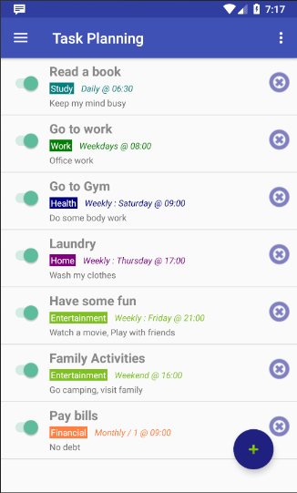
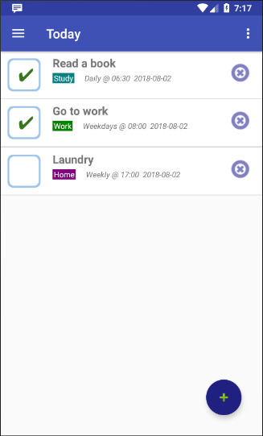

# AndroidHabitsApp
Android Application to manage tasks, activities and build habits

## Screenshots

## Features

* Task management:
  * Setup frequency, time 
  * Setup category
  * Disable tasks temporarily
  * Delete tasks
* Tasks for today and yesterday
  * Automatically created based on task planning
  * Task checking for today and yesterday
  * Discard tasks
  * Automatic notifications when tasks are pending
* Statistics
  * Task created, completed and incompleted
  * Overall statistics and percentage
  * Today statistics and percentage
  * Tasks created and completed by category
* Options and configuration
  * Show deleted tasks
  * Application language: English, Spanish, Chinese, Turkish, Portuguese
  * Notification options (only available on new android devices)
  
# Play Store

Install this application from the Google Play store at

https://play.google.com/store/apps/details?id=me.franciscoigor.habits

  
# Acnowledgements

* Translators and language contributors
  * Mert Kaval (Turkish)
  * Rodrigo Moura (Portuguese)
  * Alex Lee (Chinese)
  * Shouei Mizuno (Japanese)
  * Spanish (Francisco Igor)
  

